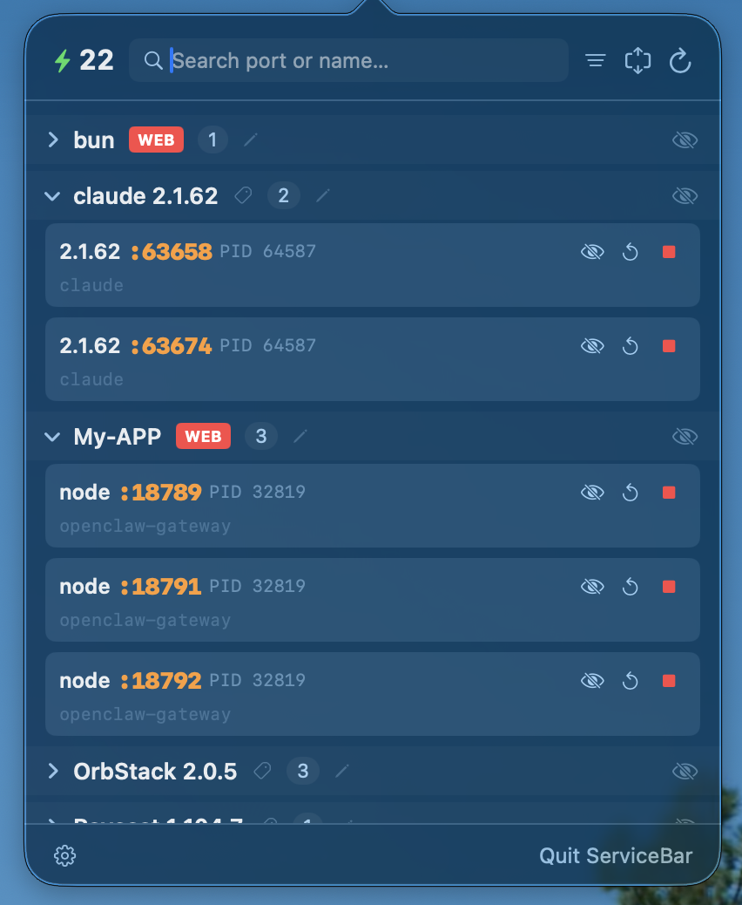

# ServiceBar

A lightweight macOS menu bar utility that monitors all services listening on TCP ports. Instantly see what's running, which ports are in use, and manage processes — all from your menu bar.



## Features

- **Real-time port monitoring** — Scans listening TCP ports via `lsof` and displays grouped services
- **Smart grouping** — Automatically groups services by application name with dev tool detection
- **Process control** — Stop, restart, or start services directly from the menu bar
- **Search & filter** — Filter by service name, port number, port range, or custom tags
- **Tag system** — Categorize groups with color-coded tags (DEV / SYS / APP / DB / WEB)
- **Drag-to-reorder** — Rearrange service groups to your preferred order
- **Click-to-copy** — Copy port numbers, PIDs, or command paths with a single click
- **Hide services** — Hide noisy system or background services from the main view
- **Group aliases** — Rename service groups for better readability
- **Auto-refresh** — Configurable refresh interval (30s to 10min)
- **Launch at login** — Optional auto-start via macOS Service Management

## Requirements

- macOS 13.0 (Ventura) or later
- Swift 5.9+

## Build

```bash
swift build                # Debug build
swift build -c release     # Release build
swift run ServiceBar       # Run locally
```

## Install

Download the latest `ServiceBar.zip` from [Releases](../../releases), unzip, and drag `ServiceBar.app` to your Applications folder.

Or build from source:

```bash
swift build -c release
cp -R dist/ServiceBar.app /Applications/
```

## Usage

Once launched, ServiceBar lives in your menu bar as a ⚙ icon with an active service count badge.

**Click** the icon to open the dashboard:

- Browse all services grouped by application
- Use the search bar to filter by name or port
- Click a port number or command path to copy it
- Stop/restart services with inline action buttons
- Tag groups, rename them, or drag to reorder
- Toggle the filter icon to show only specific tag categories

**Settings** (gear icon in footer):

- Launch at Login
- Auto-refresh interval
- Port range filter
- Menu bar icon style
- Manage hidden items

## Project Structure

```
Sources/ServiceBar/
├── ServiceBarApp.swift            # App entry, AppDelegate, menu bar setup
├── Models/
│   └── ServiceInfo.swift          # Service data model
├── Services/
│   ├── ServiceScanner.swift       # Core scanning engine & process control
│   ├── HiddenItemsManager.swift   # Hidden items persistence
│   └── GroupAliasManager.swift    # Group aliases & tag system
├── Views/
│   ├── StatusBarView.swift        # Main popover UI
│   ├── ServiceRowView.swift       # Service card component
│   ├── SettingsView.swift         # Settings panel
│   └── RefreshButton.swift        # Animated refresh button
└── Resources/
    ├── Info.plist
    └── AppIcon.png
```

## License

MIT License. See [LICENSE](./LICENSE) for details.
